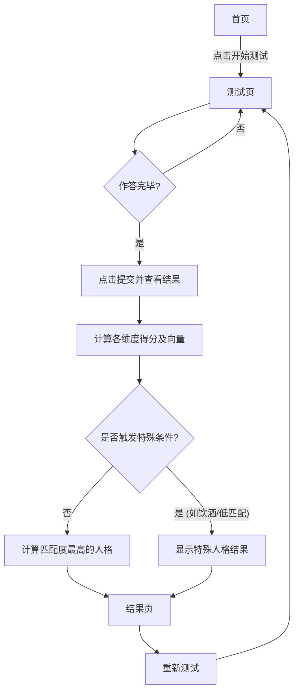

## 1. 产品概述
复刻“SBTI 人格测试”为一个轻量级的本地Web应用。
- 本项目旨在提供一个具有强娱乐属性、吐槽风格的MBTI变体人格测试（SBTI），通过一系列充满黑色幽默和夸张设定的题目，分析出用户的隐藏人格（如CTRL拿捏者、ATM-er送钱者、Dior-s屌丝等）。

## 2. 核心功能

### 2.1 功能模块
1. **首页 (Intro)**: 测试介绍、开始测试入口。
2. **测试页 (Test)**: 题目展示、进度条、选项交互、特殊触发题目（如饮酒测试）、提交入口。
3. **结果页 (Result)**: 匹配度最高的主类型展示、十五维度评分、趣味解读、重新测试及分享入口。

### 2.2 页面详情
| 页面名称 | 模块名称 | 功能描述 |
|-----------|-------------|---------------------|
| 首页 | 欢迎模块 | 显示“MBTI已经过时，SBTI来了”的标语，提供“开始测试”按钮。 |
| 测试页 | 进度展示 | 顶部显示当前答题进度（如 5 / 31）及进度条。 |
| 测试页 | 问卷列表 | 展示所有乱序后的题目。用户点击选项自动记录。包含特定条件触发的隐藏题目（如饮酒）。 |
| 测试页 | 底部操作区 | 提示用户是否完成所有题目，只有全部选完才能点击“提交并查看结果”。 |
| 结果页 | 结果海报区 | 展示用户匹配的人格类型名称、匹配度、特质图片及一句话吐槽。 |
| 结果页 | 解读区 | 详细的性格解读文案。 |
| 结果页 | 维度评分区 | 展现15个维度（S1-So3）的L/M/H等级及详细吐槽。 |
| 结果页 | 底部操作区 | “重新测试”与“回到首页”按钮。 |

## 3. 核心流程
用户进入首页，点击“开始测试”进入测试页。
在测试页中，题目随机打乱，用户依次作答。
如果在隐藏题目“饮酒门槛”中选择了特定选项，将触发追加的“酒鬼”专属题目。
全部作答完毕后点击提交，系统根据各维度的得分计算出用户的向量，与预设的人格类型库进行匹配。
如果是酒鬼触发器生效或匹配度过低，将触发特殊人格（DRUNK或HHHH）。
否则展示匹配度最高的人格结果及十五维度分析。

## 4. 用户界面设计
### 4.1 设计风格
- **主色调**: 清新的薄荷绿/森林绿系列（如 `#6c8d71`, `#4d6a53`），背景为柔和的浅色渐变。
- **按钮样式**: 带有圆角（`border-radius: 14px`）、悬浮微动效、微立体阴影效果（`box-shadow`）的现代化按钮。
- **字体**: 使用系统无衬线字体，字重分明，标题较大且有视觉冲击力。
- **布局风格**: 卡片式布局（Card-based），大量留白（Negative space），圆角风格（22px大圆角）。

### 4.2 页面设计概览
| 页面名称 | 模块名称 | UI元素 |
|-----------|-------------|-------------|
| 首页 | 欢迎卡片 | 居中对齐的大标题，醒目的主按钮，底部带有原作者等致谢信息。 |
| 测试页 | 题目卡片 | 每道题一个独立卡片，包含题号、题目描述、可点击的选项区。选中项有高亮边框和背景色。 |
| 结果页 | 结果展示区 | 顶部图文混排（左图右文或上下结构），醒目的主类型和匹配度徽章。卡片式多维度得分展示网格。 |

### 4.3 响应式设计
- 优先桌面端设计（Desktop-first），通过 CSS Grid 和 Flexbox 实现响应式布局。
- 移动端下（max-width: 860px/600px），卡片网格从多列折叠为单列，字体大小和内边距适当缩小以适应小屏幕。
