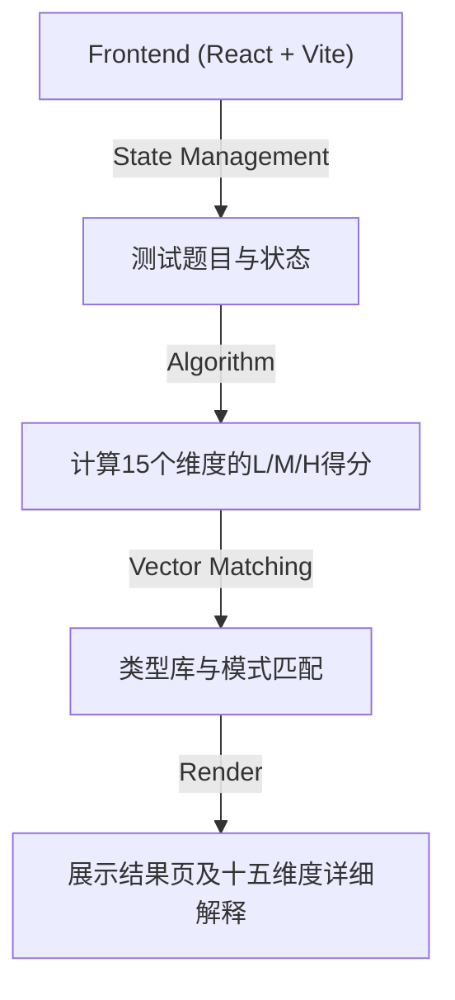

## 1. 架构设计

## 2. 技术栈说明
- **前端框架**: React 18 + TypeScript + Vite
- **UI框架**: Tailwind CSS
- **状态管理**: React Hooks (`useState`, `useMemo`, `useEffect`)
- **图标与图标库**: Lucide React
- **部署方式**: 纯静态站点部署（不依赖后端服务）。数据与题目将完全内嵌于前端代码中（从原页面的script中提取）。
- **初始化工具**: Vite CLI

## 3. 路由定义
作为轻量级的App测试，应用将采用**单页面应用 (SPA)** 和**状态驱动页面切换**的模式，无需引入复杂的 React Router。
应用内部状态 `currentScreen`:
| 状态值 | 目的 |
|-------|---------|
| `intro` | 首页 |
| `test` | 答题页 |
| `result`| 结果页 |

## 4. API 定义
此项目为纯前端的本地应用测试，无需与后端服务器进行交互。所有题目数据、答案向量、预设类型库等均静态存储在客户端的配置文件中。

## 5. 数据结构定义
应用主要包含以下核心数据结构：
### 5.1 题目数据模型 (Question)
- `id`: 题目唯一标识（如 `q1`）
- `dim`: 所属维度（如 `S1`, `E2`，或者特殊题目的标记）
- `text`: 题干描述
- `options`: 选项数组，包含 `label` 和对应的 `value`（如 1, 2, 3）。

### 5.2 维度元数据 (Dimension Meta)
- 记录 15 个维度的代号、名称、所属模型及其对应的 L/M/H 解读文案。

### 5.3 结果类型库 (Type Library)
- 包含多种人格类型（如 `CTRL`, `ATM-er`, `Dior-s` 等）。
- 包含标准的 15 维判定模式（如 `"HHH-HMH-MHH-HHH-MHM"`）。
- 每个类型带有专属的文案描述（`code`, `cn`, `intro`, `desc`）。

### 5.4 状态 (State)
- `answers`: `Record<string, number>`（记录各题答案）
- `shuffledQuestions`: `Question[]`（乱序后的题目列表）
- `result`: 包含用户最终的主类型、特殊状态触发标记、十五维度分数及文案解读等计算结果对象。
